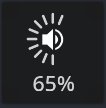
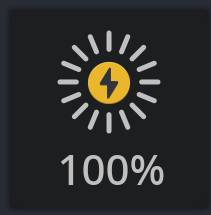

# OSD
## A simple on-screen indicator written in Rust using Gtk3

### Heavily inspired by: https://github.com/buzz/volctl

### Features:
- Indicate percentage values
- Show icons based on icon-name or file-name
- Show text at the bottom of the window
- (any combination of those three)

### Usage:
```
-v [value]  Specify the percentage
-t [value]  Specify the text
-i [value]  Specify icon
```

### Screenshots:

